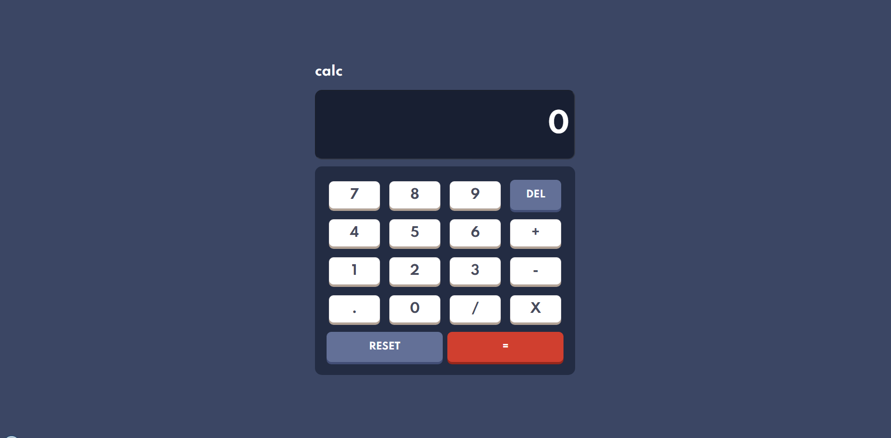

<h1 align="center"> Calculadora </h1>

    

Criação do app Calculadora baseado no desafio proposto pela Frontend Mentor que sugeriu desafios reais do mercado de trabalho afim de ajudar no desenvolvimento de novas habilidades de programação.

## Descrição

 A calculadora foi baseado no desafio de programação da Frontend Mentor no qual sugeria o desenvolvimento de uma calculadora feita em html, css, js e responsiva a partir de um esboço de como ficaria ela, que poder ser encontrado na pasta __doc__/__design__  nesse mesmo repositório. 

### Desafio proposto

os usuários devem ser capazes de:

* Veja o tamanho dos elementos ajustados com base no tamanho da tela de seus dispositivos
* Realize operações matemáticas como adição, subtração, multiplicação e divisão

## Desdobramento, desenvolvimento

O site foi construido utilizando html, css, javascript e técnicas de responsividade, as dificuldade encontradas foi a utilização do css gride e javascript, para fazer o posicionamento dos elementos e funcionalidade da calculadora mas todos os problemas foram resolvido com exito. 

## Construído com

* [HTML](https://www.w3schools.com/html/) - HTML abreviação para a expressão inglesa HyperText Markup Language, que significa: "Linguagem de Marcação de Hipertexto" é uma linguagem de marcação utilizada na construção de páginas na Web. Documentos HTML podem ser interpretados por navegadores. A tecnologia é fruto da junção entre os padrões HyTime e SGML.

* [CSS](https://www.w3schools.com/css/default.asp) - Cascading Style Sheets é um mecanismo para adicionar estilo a um documento web. O código CSS pode ser aplicado diretamente nas tags ou ficar contido dentro das tags "style". Também é possível, em vez de colocar a formatação dentro do documento, criar um link para um arquivo CSS que contém os estilos.

* [JAVASCRIPT](https://developer.mozilla.org/pt-BR/docs/Web/JavaScript) - JavaScript é uma linguagem de programação interpretada estruturada, de script em alto nível com tipagem dinâmica fraca e multiparadigma. Juntamente com HTML e CSS, o JavaScript é uma das três principais tecnologias da World Wide Web

## Autor

* **Cesar dos Santos de Almeida** - *responsável pela construção e desenvolvimento da calculadora*

## Licença
Este projeto está licenciado sob a licença MIT - consulte o arquivo  [LICENSE.md](LICENSE.md) para obter detalhes

## Agradecimentos

* [Frontend Mentor](https://www.frontendmentor.io/) - Responsável por disponibilizar o desafio e os materiais como ilustrações e imagens para a criação da calculadora

## Links
* [App calculadora](https://www.frontendmentor.io/challenges/calculator-app-9lteq5N29) - link do desafio do Frontend Mentor.
* [Frontend Mentor](https://www.frontendmentor.io/) - link do site ofical do Frontend Mentor.

